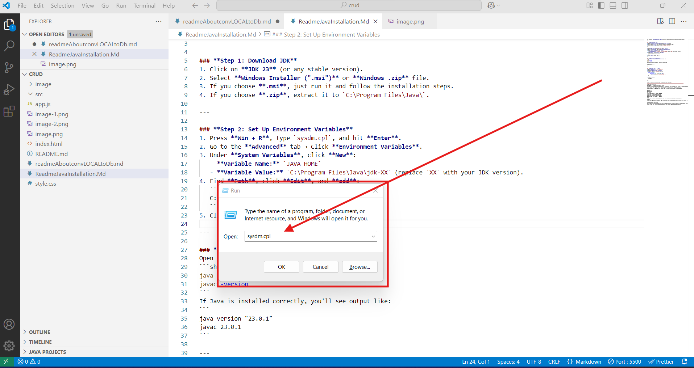
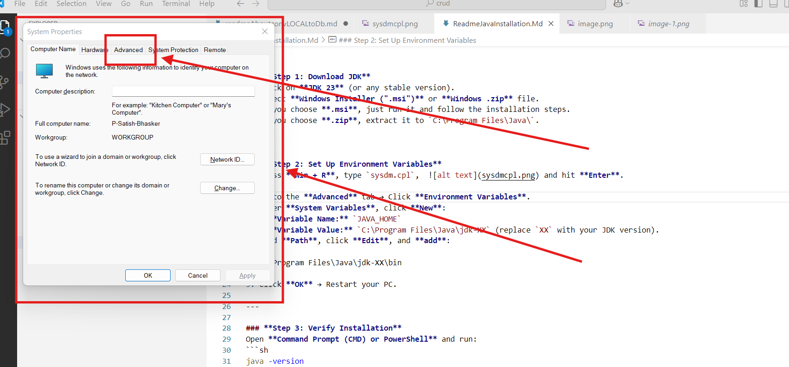
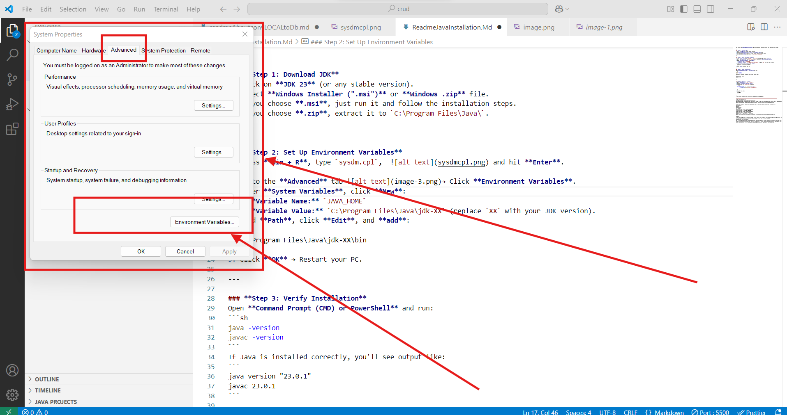
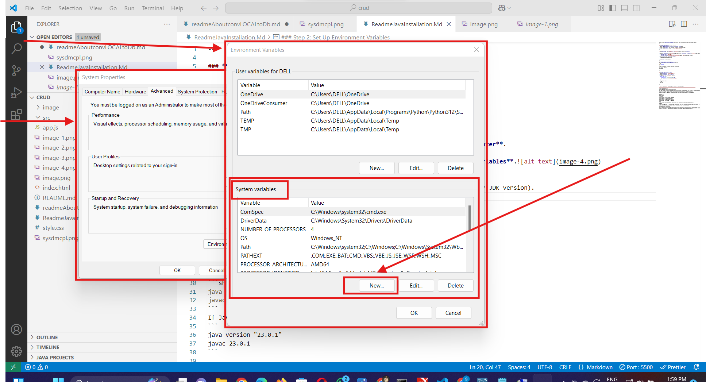
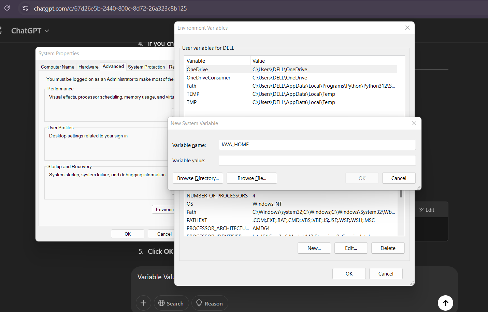
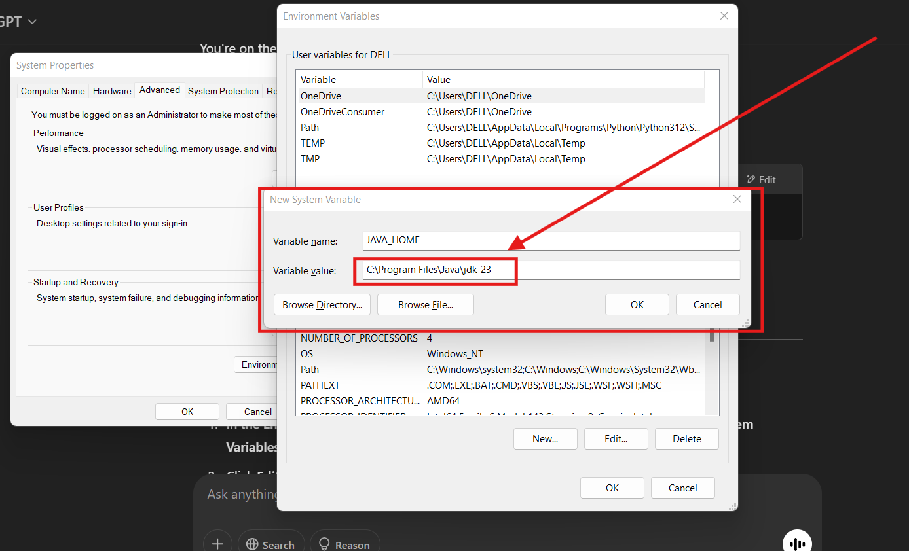
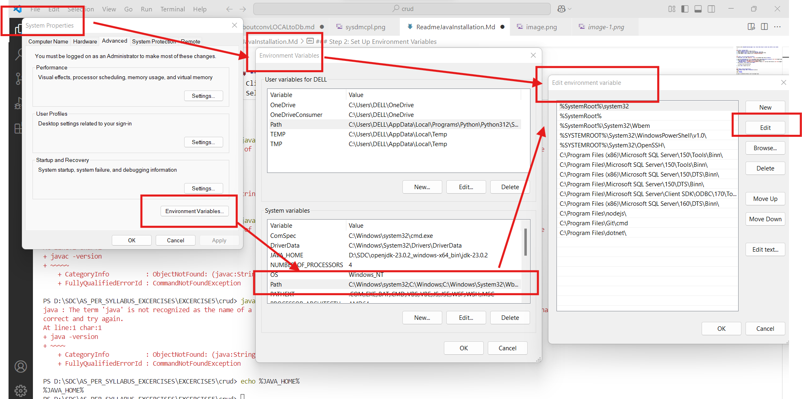
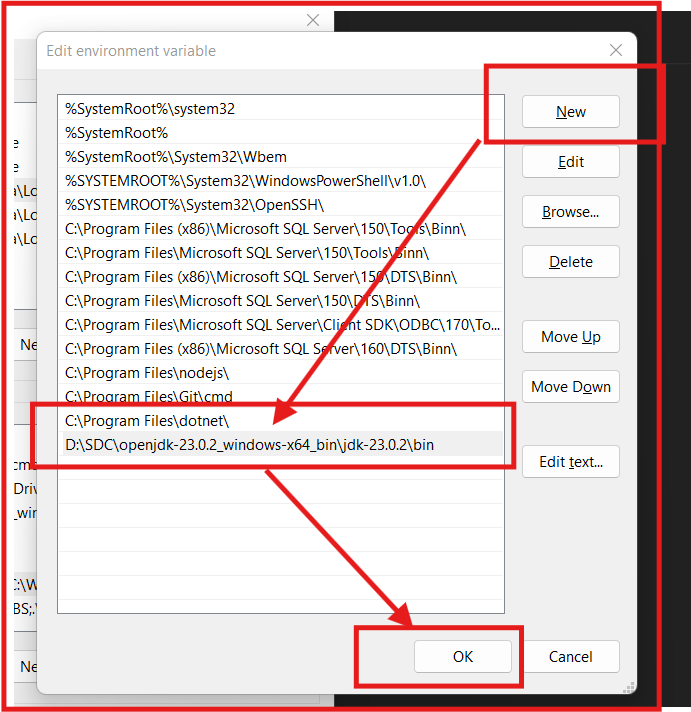

You are on the **OpenJDK download page**. Now, follow these steps to install Java (JDK) on your system:

---

### **Step 1: Download JDK**
1. Click on **JDK 23** (or any stable version).
2. Select **Windows Installer (".msi")** or **Windows .zip** file.
3. If you choose **.msi**, just run it and follow the installation steps.
4. If you choose **.zip**, extract it to `C:\Program Files\Java\`.
`
---

### **Step 2: Set Up Environment Variables**
1. Press **Win + R**, type `sysdm.cpl`,   and hit **Enter**.

2. Go to the **Advanced** tab → Click **Environment Variables**.
3. Under **System Variables**, click **New**:
   - **Variable Name:** `JAVA_HOME`
   - **Variable Value:** `C:\Program Files\Java\jdk-XX` (replace `XX` with your JDK version).
4. Find **Path**, click **Edit**, and **add**: 
   ```
   C:\Program Files\Java\jdk-XX\bin
   ```
5. Click **OK** → Restart your PC.

---

### **Step 3: Verify Installation**
Open **Command Prompt (CMD) or PowerShell** and run:
```sh
java -version
javac -version
```
If Java is installed correctly, you'll see output like:
```
java version "23.0.1"
javac 23.0.1
```

---

### **Step 4: Use Java in VS Code**
1. Open **VS Code**.
2. Go to **Extensions** (`Ctrl + Shift + X`).
3. Install **"Extension Pack for Java"**.
4. Create a new file (`Main.java`) and test:
   ```java
   public class Main {
       public static void main(String[] args) {
           System.out.println("Java is working!");
       }
   }
   ```
5. Run the file with:
   ```sh
   java Main
   ```

---

✅ Java is now installed and working! Let me know if you need help. 🚀

====================================================================================================
https://jdk.java.net/23/

OpenJDK JDK 23.0.2 General-Availability Release
This page provides production-ready open-source builds of the Java Development Kit, version 23, an implementation of the Java SE 23 Platform under the GNU General Public License, version 2, with the Classpath Exception.

Commercial builds of JDK 23.0.2 from Oracle, under a non-open-source license, can be found here.

Documentation
Features
Release notes
API Javadoc
Builds
Linux / AArch64	tar.gz (sha256)	208598806
Linux / x64	tar.gz (sha256)	210777300
macOS / AArch64	tar.gz (sha256)	204446912
macOS / x64	tar.gz (sha256)	206732010
Windows / x64	zip (sha256)	209182526
Notes
If you have difficulty downloading any of these files please contact download-help@openjdk.org.

Feedback
If you have suggestions or encounter bugs, please submit them using the usual Java SE bug-reporting channel. Be sure to include complete version information from the output of the java --version command.

International use restrictions
Due to limited intellectual property protection and enforcement in certain countries, the source code may only be distributed to an authorized list of countries. You will not be able to access the source code if you are downloading from a country that is not on this list. We are continuously reviewing this list for addition of other countries.

