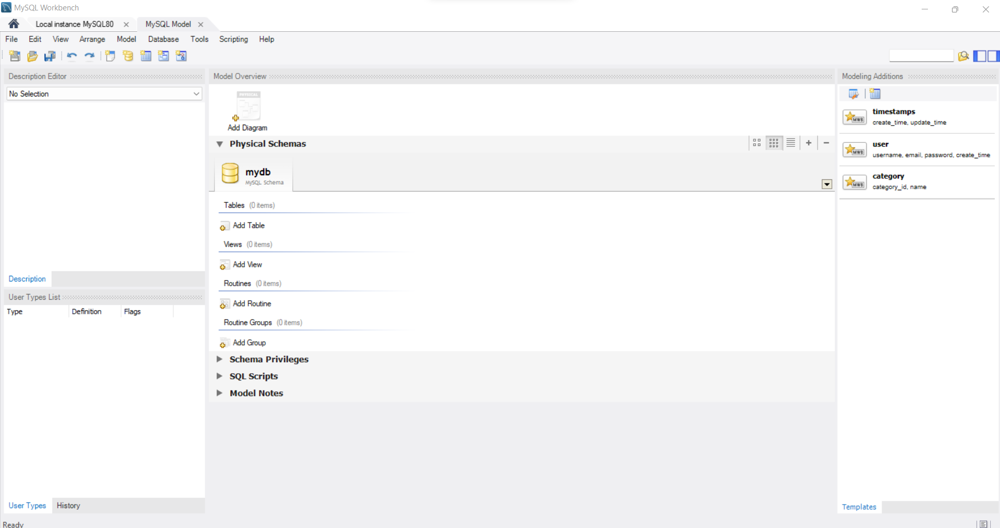
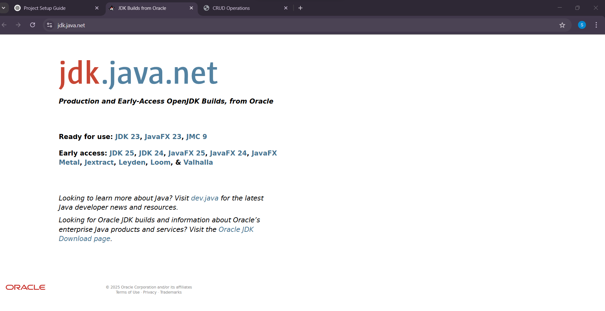

### Approach to Transition from Local Storage to Database (MySQL/Oracle) in Java

Since you’ve been using local storage for CRUD operations in JavaScript, moving to a database-backed Java application will involve these key steps:

---

### **Step 1: Set Up Your Database**
You'll need a MySQL or Oracle database. Let's assume MySQL for now.

1. **Install MySQL (if not installed)**  
   - Download from [MySQL Official Website](https://dev.mysql.com/downloads/).
   - Install MySQL Server and MySQL Workbench.

2. **Create a Database & Table**  
   Open MySQL Workbench or a terminal and run:

    
   ```sql
   CREATE DATABASE EmployeeDB;

   USE EmployeeDB;

   CREATE TABLE employees (
       id INT AUTO_INCREMENT PRIMARY KEY,
       name VARCHAR(100),
       age INT,
       city VARCHAR(100),
       email VARCHAR(100),
       phone VARCHAR(15),
       post VARCHAR(100),
       startDate DATE
   );
   ```

---

### **Step 2: Set Up Java Project in VS Code**
1. **Install Java Extension Pack in VS Code** (If not already installed).
2. **Create a New Java Project**:
   - Open VS Code.
   - Create a new folder (e.g., `JavaCRUD`).
   - Inside, create a `src` folder.
   - Open a terminal and run:
     ```sh
     javac --version  # Check if Java is installed
     ```

---

### **Step 3: Add MySQL JDBC Driver**
Java needs a connector to communicate with MySQL.
 
1. **Download MySQL Connector/J**:  
   - Get it from [MySQL Connector/J](https://dev.mysql.com/downloads/connector/j/).
   - Place the `.jar` file inside your `JavaCRUD/lib` folder.

2. **Add to Classpath**:
   - In VS Code, open `settings.json` (Ctrl + Shift + P → "Preferences: Open Settings (JSON)").
   - Add:
     ```json
     "java.project.referencedLibraries": [
         "lib/mysql-connector-java-8.0.xx.jar"
     ]
     ```

---

### **Step 4: Connect Java to MySQL**
Create a Java file `DatabaseConnection.java` inside `src`:

```java
import java.sql.Connection;
import java.sql.DriverManager;
import java.sql.SQLException;

public class DatabaseConnection {
    private static final String URL = "jdbc:mysql://localhost:3306/EmployeeDB";
    private static final String USER = "root"; // Change as per your MySQL setup
    private static final String PASSWORD = "your_password";

    public static Connection getConnection() {
        try {
            return DriverManager.getConnection(URL, USER, PASSWORD);
        } catch (SQLException e) {
            System.out.println("Database connection failed!");
            e.printStackTrace();
            return null;
        }
    }

    public static void main(String[] args) {
        Connection conn = getConnection();
        if (conn != null) {
            System.out.println("Connected to the database successfully!");
        }
    }
}
```
- **Concepts Covered**: JDBC, DriverManager, Exception Handling.

Run this file (`DatabaseConnection.java`) in VS Code terminal:
```sh
javac src/DatabaseConnection.java
java -cp "lib/mysql-connector-java-8.0.xx.jar:src" DatabaseConnection
```

---

### **Step 5: Implement CRUD Operations**
1. **Create `EmployeeDAO.java`** (Data Access Object):

```java
import java.sql.*;

public class EmployeeDAO {
    private Connection conn;

    public EmployeeDAO() {
        conn = DatabaseConnection.getConnection();
    }

    public void insertEmployee(String name, int age, String city, String email, String phone, String post, String startDate) {
        String sql = "INSERT INTO employees (name, age, city, email, phone, post, startDate) VALUES (?, ?, ?, ?, ?, ?, ?)";
        try (PreparedStatement stmt = conn.prepareStatement(sql)) {
            stmt.setString(1, name);
            stmt.setInt(2, age);
            stmt.setString(3, city);
            stmt.setString(4, email);
            stmt.setString(5, phone);
            stmt.setString(6, post);
            stmt.setDate(7, Date.valueOf(startDate));
            stmt.executeUpdate();
            System.out.println("Employee added successfully!");
        } catch (SQLException e) {
            e.printStackTrace();
        }
    }

    public void fetchEmployees() {
        String sql = "SELECT * FROM employees";
        try (Statement stmt = conn.createStatement(); ResultSet rs = stmt.executeQuery(sql)) {
            while (rs.next()) {
                System.out.println(rs.getInt("id") + " | " + rs.getString("name") + " | " + rs.getInt("age") + " | " + rs.getString("city"));
            }
        } catch (SQLException e) {
            e.printStackTrace();
        }
    }

    public void updateEmployee(int id, String name) {
        String sql = "UPDATE employees SET name = ? WHERE id = ?";
        try (PreparedStatement stmt = conn.prepareStatement(sql)) {
            stmt.setString(1, name);
            stmt.setInt(2, id);
            stmt.executeUpdate();
            System.out.println("Employee updated!");
        } catch (SQLException e) {
            e.printStackTrace();
        }
    }

    public void deleteEmployee(int id) {
        String sql = "DELETE FROM employees WHERE id = ?";
        try (PreparedStatement stmt = conn.prepareStatement(sql)) {
            stmt.setInt(1, id);
            stmt.executeUpdate();
            System.out.println("Employee deleted!");
        } catch (SQLException e) {
            e.printStackTrace();
        }
    }
}
```
- **Concepts Covered**: JDBC (PreparedStatement, ResultSet, CRUD Operations).

---

### **Step 6: Create Main Program (`Main.java`)**
This will let you interact via the console.

```java
import java.util.Scanner;

public class Main {
    public static void main(String[] args) {
        EmployeeDAO dao = new EmployeeDAO();
        Scanner scanner = new Scanner(System.in);

        while (true) {
            System.out.println("\n1. Add Employee");
            System.out.println("2. View Employees");
            System.out.println("3. Update Employee");
            System.out.println("4. Delete Employee");
            System.out.println("5. Exit");
            System.out.print("Choose an option: ");
            int choice = scanner.nextInt();

            switch (choice) {
                case 1:
                    System.out.print("Enter Name: ");
                    String name = scanner.next();
                    System.out.print("Enter Age: ");
                    int age = scanner.nextInt();
                    System.out.print("Enter City: ");
                    String city = scanner.next();
                    System.out.print("Enter Email: ");
                    String email = scanner.next();
                    System.out.print("Enter Phone: ");
                    String phone = scanner.next();
                    System.out.print("Enter Post: ");
                    String post = scanner.next();
                    System.out.print("Enter Start Date (YYYY-MM-DD): ");
                    String startDate = scanner.next();
                    dao.insertEmployee(name, age, city, email, phone, post, startDate);
                    break;
                case 2:
                    dao.fetchEmployees();
                    break;
                case 3:
                    System.out.print("Enter Employee ID: ");
                    int id = scanner.nextInt();
                    System.out.print("Enter New Name: ");
                    String newName = scanner.next();
                    dao.updateEmployee(id, newName);
                    break;
                case 4:
                    System.out.print("Enter Employee ID: ");
                    int deleteId = scanner.nextInt();
                    dao.deleteEmployee(deleteId);
                    break;
                case 5:
                    System.exit(0);
            }
        }
    }
}
```
- **Concepts Covered**: Loops, User Input, Switch Statements, JDBC.

---

### **Step 7: Run the Program**
```sh
javac -cp "lib/mysql-connector-java-8.0.xx.jar:src" src/*.java
java -cp "lib/mysql-connector-java-8.0.xx.jar:src" Main
```
Now, your Java program will store and manage data in MySQL instead of local storage.

---

This is a **simple command-line CRUD application** using Java & MySQL. Later, you can add a GUI using **Swing or JavaFX**. Let me know if you need further explanations! 🚀